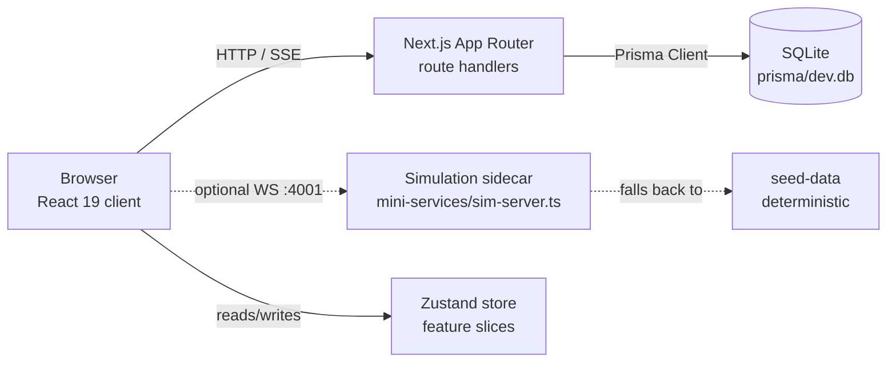
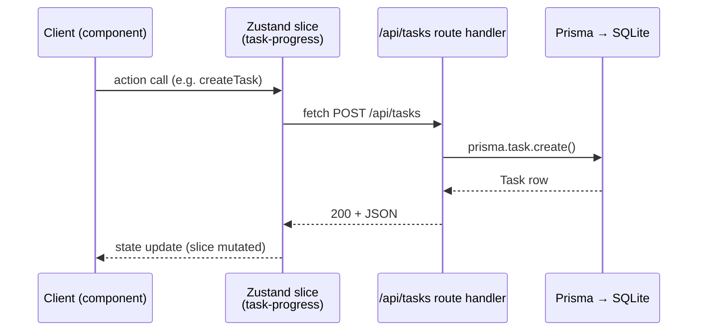
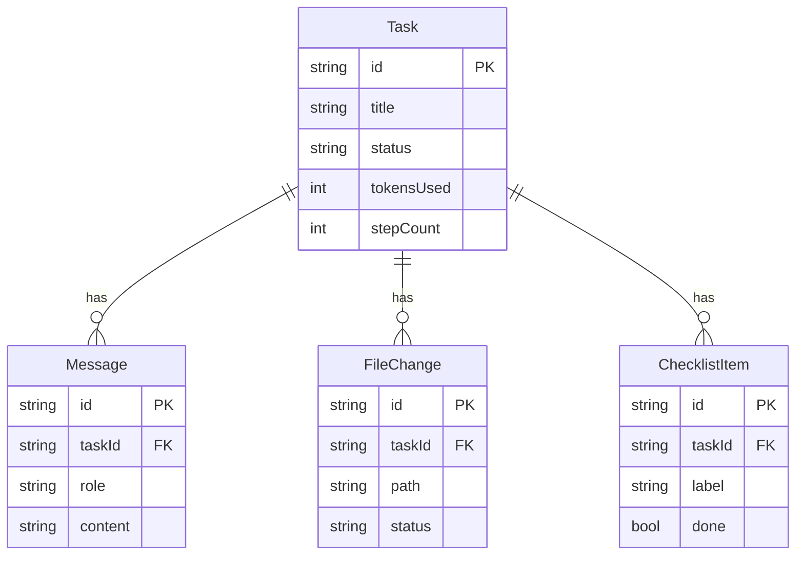

# Architecture

> **⚠️ Teardown notice:** This document describes the *pre-teardown* app
> (simulation sidecar, mock-data slices, demo UI components). Those were removed
> in the `teardown-to-minimal-shell` workflow — see [`TEARDOWN.md`](../TEARDOWN.md)
> for what was removed/preserved. The app is now a minimal empty shell; this doc
> is retained as historical reference and should be rewritten when real features
> are built.

This is the canonical architecture reference for **zcode-workspace** — a
Next.js 16 + React 19 + Tailwind 4 + shadcn/ui admin-dashboard template styled
as an AI development workspace ("ZCode"). It documents the stack, how requests
flow, the state model, and the data model.

For "how to work in this repo" (task gates, conventions), see `AGENTS.md`.

## Stack

| Layer | Technology |
|---|---|
| Framework | Next.js 16 (App Router, `output: "standalone"`) |
| UI | React 19 + Tailwind 4 + shadcn/ui (Radix primitives) |
| State | Zustand (single store, composed feature slices) |
| Server state | TanStack Query |
| Tables | TanStack Table |
| Forms | React Hook Form + zod resolvers |
| Schema | zod v4 |
| ORM | Prisma (SQLite) |
| Styling extras | class-variance-authority, clsx, tailwind-merge, tw-animate-css |
| Animation | framer-motion |
| Charts | recharts |
| Auth | next-auth |
| i18n | next-intl |
| Runtime | Bun (`bun.lock`) |
| Optional sidecar | socket.io simulation server (`mini-services/sim-server.ts`) |

## High-level layout



The simulation sidecar is **optional** — `useSimulation` falls back to
deterministic seed data when the websocket can't connect. This "optional
dependency, deterministic fallback" shape is the reference pattern for new
integrations.

## Request flow — task API

The `Task` resource is the canonical end-to-end example (server route handler →
Prisma → client store slice):



Route handlers live under `src/app/api/`:

| Route | Methods | Purpose |
|---|---|---|
| `/api` | GET | Health/info |
| `/api/chat` | POST | Chat completions (streams via `z-ai-web-dev-sdk`) |
| `/api/tasks` | GET, POST | List / create tasks |
| `/api/tasks/[id]` | GET, PATCH, DELETE | Read / update / delete a task |

## State model — Zustand feature slices

State is a **single** Zustand store composed from feature slices. Each feature
lives in `src/lib/features/<name>/` with a consistent shape:

```
src/lib/features/<name>/
  index.ts    — public exports (actions, types, slice factory)
  slice.ts    — slice definition (state shape + actions)
  mock.ts     — mock/seed data for that slice (optional)
```

Current feature slices:

| Slice | Responsibility |
|---|---|
| `chat-streaming` | Streaming chat messages + events |
| `composer` | Composer input, mode, model, effort |
| `connections` | Remote connection configuration |
| `file-changes` | File change entries / pills |
| `providers` | AI provider + model registry, reordering |
| `settings` | App settings |
| `simulation` | Simulation sidecar connection state |
| `source-control` | Git/source-control view state |
| `task-progress` | Task list, progress, checklists |
| `uploads` | File uploads |

Slices are merged in `src/lib/store.ts`. **Add new state domains as a new
slice**; do not bolt unrelated fields onto an existing slice.

## Data model — Prisma / SQLite

`prisma/schema.prisma` is the source of truth. Four models:



After editing `schema.prisma`, regenerate the client and sync the DB:
`bun run db:generate && bun run db:push`.

## Client composition

```
src/app/layout.tsx          — root layout (metadata, providers, SimulationProvider)
src/app/page.tsx            — home: renders <ZCodeWorkspace/>
src/components/zcode/
  zcode-workspace.tsx       — top-level shell composing the 3-pane layout
  left-sidebar.tsx          — project/task navigation
  central-content.tsx       — main workspace (composer, transcript)
  right-sidebar.tsx         — context panels (source-control, providers, ...)
  settings-view.tsx         — settings UI
  simulation-provider.tsx   — React context wiring the optional sim sidecar
  source-control-section.tsx, providers-section.tsx, connections-section.tsx,
  keybindings-section.tsx, file-tree-panel.tsx, file-diff-view.tsx,
  file-pill.tsx, remote-connect-dialog.tsx — feature panels
src/components/ui/          — shadcn/ui primitives (design system; ~48 files)
```

## Type safety note

`next.config.ts` sets `typescript.ignoreBuildErrors: true`, so `next build`
does **not** typecheck. An explicit `bunx tsc --noEmit` gate is therefore
mandatory before considering work complete (see `AGENTS.md`).

## Further reading

- `AGENTS.md` — working conventions and task-completion gates
- `.docs/workspace-layout.md` — directory-by-directory reference
- `mini-services/README.md` — simulation sidecar contract (ports, events, fallback)
- `prisma/schema.prisma` — data model source of truth
